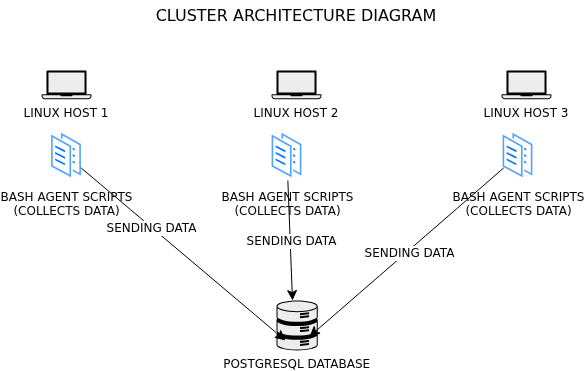

# Linux Cluster Monitoring Agent
This project is under development. Since this project follows the GitFlow, the final work will be merged to the main branch after Team Code Team.

# Introduction  
This project works as a simple monitoring system for Linux servers. It collects basic details about each server, like hardware information, and also tracks how much CPU and memory are being used over time. All this data is saved in a PostgreSQL database. Over time, this data can be queried using SQL to identify trends. The system uses small Bash scripts that run on each server. One script runs only once to save the hardware details. Another script runs again and again to save the live usage data. The database runs inside Docker, which makes the setup clean and easy to manage. GitHub is used to manage the source code.
This project is made for the LCA team managers and admins. It helps them understand server performance and plan future needs, like adding or removing servers. This project demonstrates how Linux, Bash scripting, Docker, Git, and PostgreSQL can work together to create a basic monitoring solution.

# Quick Start 

```bash
# Start PostgreSQL using Docker
./scripts/psql_docker.sh start

# Create tables
psql -h localhost -U postgres -d host_agent -f sql/ddl.sql

# Insert hardware specification data (run once)
bash scripts/host_info.sh localhost 5432 host_agent postgres password

# Insert host usage data (manual test)
bash scripts/host_usage.sh localhost 5432 host_agent postgres password

# Set up crontab to collect usage every minute
crontab -e
* * * * * bash /home/rocky/dev/jarvis_data_eng_SanyaBansal/linux_sql/scripts/host_usage.sh localhost 5432 host_agent postgres password > /tmp/host_usage.log 2>&1
```
# Implemenation 
The monitoring system was built using Bash scripts, PostgreSQL, Docker, and cron. Two scripts were created: host_info.sh, which collects hardware details such as CPU type, number of CPUs, total memory, and hostname and runs only once to register the server, and host_usage.sh, which collects real-time usage data such as free memory, CPU usage, CPU kernel time, disk I/O, and available disk space. The host_usage.sh script is scheduled with cron to run every minute, ensuring continuous data collection. All this data is saved in a PostgreSQL database. The PostgreSQL database runs in Docker for easy setup, and all data is stored in two tables: host_info for hardware details and host_usage for usage metrics. Testing was performed on a single machine to verify that the scripts correctly captured the data. Even on one machine, the system simulates a real server cluster and can be scaled to multiple hosts if needed. 
## Architecture



## Scripts
Shell script description and usage:

```bash
# 1. psql_docker.sh
# Description: Starts/stops a PostgreSQL instance inside Docker.
# Usage:
./psql_docker.sh start
./psql_docker.sh stop

# 2. host_info.sh
# Description: Collects static hardware details of the server, such as CPU type, number of CPUs, CPU architecture, CPU model, CPU speed, L2 cache, total memory, and hostname. Inserts the data into the host_info table. This script runs only once per server.
# Usage:
bash host_info.sh localhost 5432 host_agent postgres password
# 3. host_usage.sh
# Description: Collects dynamic server usage data, including free memory, CPU idle percentage, CPU kernel usage, disk I/O, and available disk space. Inserts data into the host_usage table. This script runs repeatedly via cron to collect data continuously.
# Usage:
bash host_usage.sh localhost 5432 host_agent postgres mypassword
# 4. crontab
# Description: Automates the execution of host_usage.sh at regular intervals (for example, every minute) so that usage data is collected automatically.
# Usage:
crontab -e
# Example line to run host_usage.sh every minute:
* * * * * bash /home/rocky/dev/jarvis_data_eng_SanyaBansal/linux_sql/scripts/host_usage.sh localhost 5432 host_agent postgres password > /tmp/host_usage.log 2>&1

# 5. queries.sql
# Description: Contains SQL queries to analyze the collected data and answer business questions,
# Example business problems:
# - Average memory usage
# - Identify hosts with high CPU or memory usage over time.
# - Determine which hosts are underutilized and can be decommissioned.
```
## Database Modeling
 
### host_info

| Column Name       | Data Type   | Description |
|------------------|------------|------------|
| id               | SERIAL     | Unique identifier for each host (Primary Key) |
| hostname         | VARCHAR    | Name of the host (Unique) |
| cpu_number       | INT2       | Number of CPU cores |
| cpu_architecture | VARCHAR    | CPU architecture (e.g., x86_64) |
| cpu_model        | VARCHAR    | CPU model name |
| cpu_mhz          | FLOAT8     | CPU speed in MHz |
| l2_cache         | INT4       | L2 cache size in KB |
| timestamp        | TIMESTAMP  | Timestamp when the host record was created/updated |
| total_mem        | INT4       | Total memory in MB |

---

### host_usage

| Column Name     | Data Type   | Description |
|----------------|------------|------------|
| timestamp      | TIMESTAMP  | Timestamp when the usage data was recorded |
| host_id        | SERIAL     | Foreign key referencing `host_info.id` |
| memory_free    | INT4       | Free memory in MB |
| cpu_idle       | INT2       | CPU idle percentage |
| cpu_kernel     | INT2       | CPU time spent in kernel mode (%) |
| disk_io        | INT4       | Disk I/O in KB/s |
| disk_available | INT4       | Available disk space in KB |

# Test 
All the scripts were tested in a sequential manner.

```bash

# Check if PostgreSQL container is running
docker ps

# Verify tables exist
psql -h localhost -U postgres -d host_agent -c "\dt"

# Check host_info data
psql -h localhost -U postgres -d host_agent -c "SELECT * FROM public.host_info;"

# Check host_usage data
psql -h localhost -U postgres -d host_agent -c "SELECT * FROM public.host_usage;"
**Results:** All scripts executed successfully. Tables are created and populated correctly, and queries return expected results. Additionally, the `host_info` table is automatically updated every minute using a cron job, ensuring that new host data is continuously added without manual intervention.
```
# Deployment 
First, the PostgreSQL database is deployed using Docker. A container is created that runs PostgreSQL. 
Next, the Bash scripts are placed on each server (or node). These scripts act as agents.
-host_info.sh is deployed and run once during setup. It registers the server in the database.
-host_usage.sh is deployed and scheduled using cron.
Cron is responsible for automation. It runs host_usage.sh every minute without human intervention. This ensures continuous and real-time data collection. Logs are redirected to a file so errors can be traced easily.
The source code is stored and versioned in GitHub. Any update to scripts is pushed to the repository and then pulled on the servers. This keeps all agents consistent and makes collaboration easy.

# Improvements 
1.Add update logic to the agent scripts to handle hardware changes dynamically.
2.Add error handling and retry logic for database connection failures.
3.Implement alerting for threshold breaches (e.g., low disk space).

