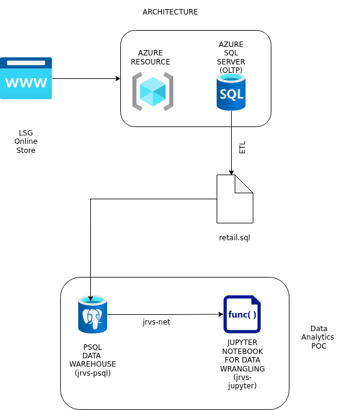

# Introduction

This is a proof-of-concept project that analyzes historical retail transaction data from London Gift Shop (LGS) which is a UK-based online retailer specializing in giftware, serving a large wholesale customer base.This is done to uncover patterns in customer purchasing, product performance, and revenue generation as the retailer is struggling with revenue growth. The results are intended to support the marketing team in designing targeted campaigns, such as personalized promotions, email outreach, and customer-specific events, ultimately contributing to increased engagement and revenue.

The project employs Python and Jupyter Notebook for data analysis, with Pandas and NumPy for data wrangling, and a lightweight PostgreSQL-based data warehouse to facilitate structured exploration and efficient querying.

**Technologies and Tools:**
- Python  
- Jupyter Notebook  
- Pandas, NumPy  
- PostgreSQL (data warehouse)  
- Docker (containerized environment for reproducibility)  

# Implementaion

## Project Architecture

This proof-of-concept simulates a simplified analytics environment that analyzes customer purchasing data from the LGS online store. It operates independently of LGS production systems while enabling meaningful insights for the marketing team.

**Components:**

1. **LGS Online Store (Web App & Transactional System)**  
   - Customer transactions are generated through the LGS online store, a web application hosted on Microsoft Azure.
   - Data includes invoices, products, quantities, prices, and customer IDs  

2. **ETL / Data Export**  
   - The LGS IT team extracts transactional data covering **01/12/2009 to 09/12/2011** into a SQL file  
   - Sensitive customer information is removed to ensure privacy  

3. **PostgreSQL Container (`jrvs-psql`)**  
   - Serves as a lightweight data warehouse for the proof-of-concept  
   - Stores cleaned transactional data for analysis  

4. **Jupyter Notebook Container (`jrvs-jupyter`)**  
   - Performs data wrangling, exploratory analysis, and visualization  
   - Uses Python libraries such as Pandas and NumPy  

5. **Docker Bridge Network (`jarvis-net`)**  
   - Connects the PostgreSQL and Jupyter containers  
   - Allows Python code in the notebook to query the database using container names.

## Data Analytics and Wrangling

The transactional data was cleaned, transformed, and analyzed using Python to derive actionable business insights. Key steps included:

- Standardizing column names and formats  
- Handling missing values, canceled transactions, and anomalies  
- Converting data types for accurate aggregation  
- Aggregating and analyzing data to uncover trends in revenue, customer behavior, and product performance  
- Visualizing data using bar charts, line charts and histograms to uncover trends in sales patterns  
- Performing RFM (Recency, Frequency, Monetary) analysis for customer segmentation  

The complete workflow is documented in the Jupyter Notebook:

[Retail Data Analytics and Wrangling](./python_data_wrangling/retail_data_analytics_wrangling.ipynb)

From the segmentation analysis, we can formulate strategies which helps prioritize marketing efforts, for example:
- **Champions and Loyal Customers**: Offer exclusive promotions and loyalty rewards to retain and upsell.  
- **Potential Loyalists and Promising**: Focus on nurturing campaigns to increase engagement and repeat purchases.

# Improvements

Potential Improvements can be:

1. **Enhanced Customer Segmentation**  
   Incorporate demographic or geographic data (if available) to refine customer clusters for even more targeted campaigns.  

2. **Interactive Dashboards**  
   Build dashboards (Power BI / Tableau) to let the marketing team explore trends and monitor KPIs in real time.  

3. **Automated Data Refresh and Reporting**  
   Set up a simple ETL pipeline to automatically load new transactional data into PostgreSQL and refresh visualizations regularly.

